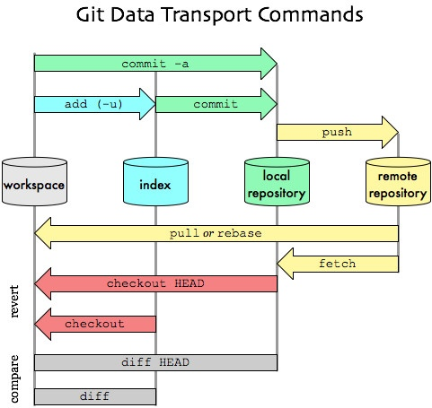

create a new repository 
```
git init
```

to clone a repository 
```
git clone <repository>
```

to prepare the specific content staged for the next commit 
```
git add <file>
git add .  # add all files
git add -u . # add only modified file, no the new ones
git add -A # add all files
```

Show the working tree status, more in details the differencies between:
- index file and the current HEAD commit
- working tree and the index file
- working tree and not tracked file by Git
```
git status
```
Record changes to the repository
```
git commit -m "message del commit" # use a specific commit git commit -c HEAD # it use the last commit message
```
Show commit logs
```git log```
Show the actual branch and list all the available branches 
```git branch```

Change the current branch
```git checkout <branch>```

Update the current branch with the latest changes from the remote repository:

```git pull```

Upload local changes to the remote repository:
```git push```


## Basic example 

I created the 0_base_commands.md file 
```
git add .
or 
git add 0_base_commands.md

git commit -m <message>
git push 
```

## New Branch example

```
git branch feature-branch #create a new branch "feature-branch"
git checkout feature-branch # switch to new branch 
```
or 
```
git branch -b feature-branch # create and switch to new branch 
```

edit something 
```
git add .
git commit -m <mesage>
git push
git checkout main
git merge feature-branch
git push 
```

# List of terms that could be useful to know

- **Workspace or Working tree:** is the directory tree of (source) files that you see and edit.
- **Index (Staging Area): ** it is an intermediate area where changes are prepared before being committed. It serves as a staging ground for modifications.
- **HEAD:** A special pointer that indicates the latest commit in the currently checked-out branch. It represents the most recent state of the project and is used as a reference for creating new commits.

